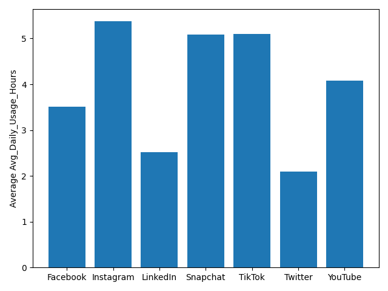

# Štatistický projekt – Matúš Tóth – Students' Social Media Addiction

Tieto dáta pochádzajú z datasetu: [Student Social Media & Relationships](https://www.kaggle.com/datasets/adilshamim8/social-media-addiction-vs-relationships)  
Dataset obsahuje anonymizované záznamy o správaní $110$ študentov na sociálnych sieťach (Facebook, Instagram, LinkedIn, Snapchat, TikTok, Twitter, YouTube) a ich vplyve na študijné výsledky a počet hodín spánku respondentov.

Všetky Python skripty, ako aj dáta, nájdete v GitHub repozitári:
[https://github.com/toth-matus/past](https://github.com/toth-matus/past)

## Test dobrej zhody

V tejto sekcii sa budeme sústrediť na vzťah medzi **ovplyvnením študijných výsledkov** *(Affects_Academic_Performance)* a **najčastejšie používanou platformou** *(Most_Used_Platform)*.  
**Nulová hypotéza:** Respondenti pociťujú vplyv na svoje akademické výsledky bez ohľadu na platformu, na ktorej trávia čas.

Zdrojový kód sa nachádza v súbore `src/chi2_test.py` (alebo kliknite [sem](src/chi2_test.py)).

Výsledky vyššie uvedeného skriptu sú:

```bash
All data chi^2 test:
Calculated chi^2: 29.33
Table value chi^2: 12.59
(With significance level: 0.05 and degree of freedom: 6)
```

Pre všetky dáta a všetky platformy **zamietame nulovú hypotézu**, keďže naša nameraná hodnota $\chi^2$ bola vyššia ako tabuľková hodnota pre $\alpha = 0.05$.

Medzi dátami sú však niektoré platformy, ktoré sú charakterovo odlišné (**LinkedIn**). Keď zopakujeme predchádzajúce meranie pre dáta, z ktorých sme odstránili používateľov platformy LinkedIn, **nemôžeme zamietnuť nulovú hypotézu**.

```bash
Chi^2 test without LinkedIn users:
Calculated chi^2: 8.02
Table value chi^2: 11.07
(With significance level: 0.05 and degree of freedom: 5)
```

Tieto výsledky môžu byť spôsobené tým, že:

- LinkedIn je platforma, na ktorej trávia používatelia relatívne málo času (viď `src/platform_time_spent.py` alebo kliknite [sem](src/platform_time_spent.py)),
- trávenie času na LinkedIn je častejšie u študentov, ktorí excelujú v škole,
- alebo ide o úlne iný dôvod.

Priemerný strávený čas na platformách:


## Štatistika korelácie

V tejto sekcii sa budeme sústrediť na koreláciu medzi **priemerným časom stráveným na danej platforme** *(Avg_Daily_Usage_Hours)* a **počtom hodín spánku** *(Sleep_Hours_Per_Night)* respondentov.  
**Nulová hypotéza:** Medzi *Avg_Daily_Usage_Hours* a *Sleep_Hours_Per_Night* nie je korelácia.

Zdrojový kód sa nachádza v súbore `src/correlation_test.py` (alebo kliknite [sem](src/correlation_test.py)).

Výsledok vyššie uvedeného skriptu je:

```bash
Spearman rho value: -0.96
p-value: 1.5570570249936598e-62
```

Z hodnoty **$\rho$** vyplýva, že existuje silná inverzná závislosť medzi *Avg_Daily_Usage_Hours* a *Sleep
_Hours_Per_Night*. (Samozrejme, nejde o dôkaz kauzality.)  
Z hodnoty $p < 0.05$ môžeme **zamietnuť nulovú hypotézu** $($pre $\alpha = 0.05)$ a predpokladať, že medzi dátami existuje korelácia.

Naplottované dáta:

